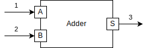
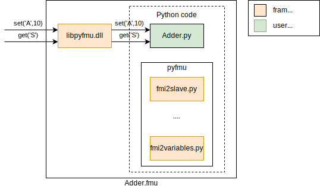
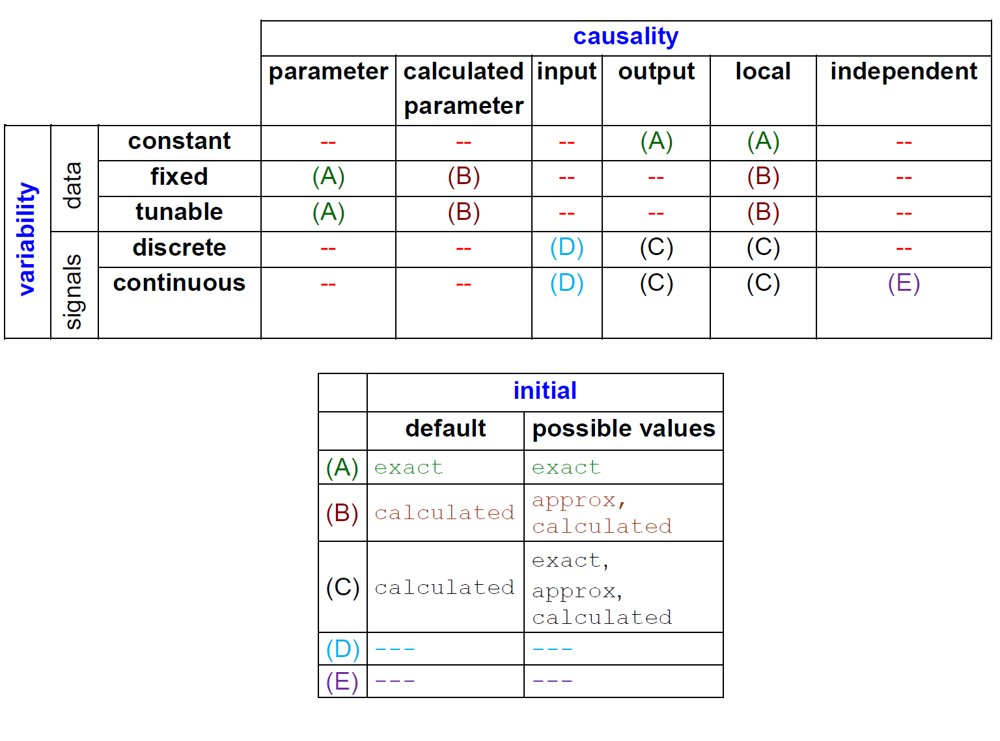

[](https://badge.fury.io/py/pyfmu)
[](https://into-cps-application.readthedocs.io/en/latest/?badge=latest)

# PyFMU

PyFMU is a library that allows FMUs to be implemented using in Python 3. Its goal is to enable rapid prototyping of a wide of FMUs for a wide range of use cases.

Its highligts include:

* Supports FMI 2.0.
* Write FMUs in high-level langauge.
* Use the extensive collection of standard and third party libraries.
* Model description automatically generated.
* Model can be changed without re-compilation.

**PyFMU is still work in progress. Only Linux is supported currently.**

## Installing

The project consists of two parts:

1. C/C++ shared library which acts which serves as an 'wrapper' around the Python code.
2. Set of tools for generating and exporting projects.


The wrapper is build using CMake as follows:
``` bash
mkdir build
cd build
cmake ..
```
This will download external dependencies and try to locate Python 3 development headers.
Building the wrapper automatically copies it to the resources of the PyFMU tool.

To install the tools from source pip can be invoked from the root dir.
``` bash
pip install -e.
```

## Usage

The library comes with a command line tool pyfmu which eases the creation of projects and the subsequent export as FMUs

As an example a two input Adder is used.

### Generating and implementing

To create a new project the *generate* command is used:
``` bash
pyfmu generate --path /someDir/Adder
```

This generates an empty project containing the necessary resources and configuration files.
By default a template of the slave class is generated. In this case a file *adder.py* defining the class *Adder* is created.

This subclasses the Fmi2Slave class which provides the methods necessary to define the FMU.
``` Python
class Adder(Fmi2Slave):

    def __init__(self):
        # programatically register variables here
        ...

    def do_step(self, current_time: float, step_size: float) -> bool:
        return True
    
    ...
```

To define inputs, outputs and parameters the *register_variable* function is used. 
For a two input adder the inputs and outputs can be specified as:
``` Python
def __init__(self):
    ...
    self.register_variable("s", data_type=Fmi2DataTypes.real, causality=Fmi2Causality.output)
    self.register_variable("a", data_type=Fmi2DataTypes.real, causality=Fmi2Causality.input, start=0)
    self.register_variable("b", data_type=Fmi2DataTypes.real, causality=Fmi2Causality.input, start=0)
```
Note that the variables MUST be defined either in the *\_\_init\_\_* function or as part of a call chain resulting from it. This requirement is related to how model descriptions are extracted.

To implement the dynamics of the FMU the functions of the baseclass must be overwritten.
For the adder we define the *do\_step* and *exit\_initialization\_mode* of the Adder class.
``` Python
def exit_initialization_mode(self):
        self.s = self.a + self.b
        return True

def do_step(self, current_time: float, step_size: float) -> bool:
    self.s = self.a + self.b
    return True
```
It is not necessary to implement the **set\_xxx** and **get\_xxx** functions. By default these are mapped directly to instance variables.

### Exporting

To export an project as an FMU the **export** subcommand is used:

``` bash
pyfmu export -p /someDir/Adder -o /myFMUs/Adder
```

The result of this command is an FMU containing the Python that was just written.

Under the hood a few things happen:
* Wrapper is copied to binaries
* Resources are copied into the archive
* A model description is generated.

The model description for the adder project looks like:

``` XML
<?xml version="1.0" ?>
<fmiModelDescription author="" fmiVersion="2.0" generationDateAndTime="2020-02-23T09:30:00Z" generationTool="pyfmu" guid="221df7a6-36d3-41f7-bc35-8489663bb7ae" modelName="Adder" variableNamingConvention="structured">
   <CoSimulation modelIdentifier="pyfmu" needsExecutionTool="true"/>
   <ModelVariables>
      <!--Index of variable = "1"-->
      <ScalarVariable causality="output" initial="calculated" name="s" valueReference="0" variability="continuous">
         <Real/>
      </ScalarVariable>
      <!--Index of variable = "2"-->
      <ScalarVariable causality="input" name="a" valueReference="1" variability="continuous">
         <Real start="0"/>
      </ScalarVariable>
      <!--Index of variable = "3"-->
      <ScalarVariable causality="input" name="b" valueReference="2" variability="continuous">
         <Real start="0"/>
      </ScalarVariable>
   </ModelVariables>
   <ModelStructure>
      <Outputs>
         <Unknown dependencies="" index="1"/>
      </Outputs>
      <InitialUnknowns>
         <Unknown dependencies="" index="1"/>
      </InitialUnknowns>
   </ModelStructure>
</fmiModelDescription>
```

## Examples
See the tests/examples/projects folder.

## Acknowledgements

* Lars Ivar Hatledal: For his implementation of PythonFMU which was the initial starting point for PyFMU.

<!-- # How does it work?

At a conceptual level an FMU can be thought of as a black box that converts a number of inputs into a number of outputs.

A simple example of this is an _adder_, which takes as input two numbers and produces the sum of these as its output.



The FMU can be interacted with using several functions defined by the FMI specification. Some of the most essential of these are for getting values, setting values and advancing the simulation by taking a step. Using these three operations we can outline the process of simulating the adder as follows:

1. Initializing the FMU
2. Setting the value of the input A
3. Setting the value of the input B
4. Performing a step
5. Getting the value of output S

To reiterate, the FMI standard defines the interface that is implemented by FMUs. A key source of confusion how this interface may be _implemented_ in practice. In particular it may be unclear which programming languages can be used.

To clarify this it we may take a look at how the adder may look like as an FMU. Below is an example of what the file structure of the FMU may look like:

```
adder
|
+---binaries
|   +---win64
|   |   adder.dll
|   +---linux64
|   |   adder.so
|
+---resources
|   configuration.txt
|
+---sources
|   adder.c
|
|   modelDescription.xml
```

At a very rudementary level, a FMU is a shared object bundled with at configuration file _modelDescription.xml_, which declares its inputs, outputs and parameters.

- The shared object is what implements the behavior of the particular FMU. It does so by implementing the methods defined in the FMI specification.
- The model description acts as an interface for the simulation tools importing the FMU. It does so by expressing what inputs and outputs exist and what other capabilities are available.

It is important to note that the standard does not dictate **HOW** the shared object implements the functionality.
As a result there are fundamentally two ways to implment an FMU.

### **Compiled FMU**

The FMU is written in a compiled language that is capable of producing a shared object such as C. In addition to the specification itself, the standard is also shipped a number of C header files.
Implementing the headers in C makes it possible to compile the shared object as illustrated below:


Its important to emphasize that, even though C is the "favored" language, it is still possible to use any other language, as long as the resulting shared object is ABI compatible.

### **Wrapper FMU**

An alternative approach to implementing the FMU in a compiled language, is to instead create a wrapper which defers calls to an interpreter of another language.




The correspondance between the call to the FMI interface and the resulting call to the Python can be illustrated as:

C-code:
```C
fmi2Status fmi2DoStep(fmi2Component c, fmi2Real currentCommunicationPoint,
                      fmi2Real communicationStepSize, fmi2Boolean) {
                      
  status = wrapped.doStep(currentCommunicationPoint, communicationStepSize);
  
  return status;
}

```

Python-code:
```Python
def do_step(self, current_time: float, step_size: float) -> bool:
    
    self.S = self.A + self.B
    
    return True
```

# Prerequisites

## [Conan](https://docs.conan.io/en/latest/)

```bash
pip3 install conan
```

## [pytest](https://docs.pytest.org/en/latest/contents.html)

```
pip3 install pytest
```

## [CMake](https://cmake.org/download/)

Cross platform build system used to build the binaries that serves as wrappers for the Python scripts.

Linux using package manager:

```bash
sudo apt install cmake
```

Linux building from source:

1. download sources

**Note that the CMake scripts requires atleast version 3.10 of CMake**. This specific version is arbitrarily selected at the time.

# Usage

The utility program py2fmu provides

## Generating a project
To generate a project the **generate** command can be used:
```bash
python3 py2fmu.py generate --n Adder
```

## Export project
To export the project as an FMU the **export command** is used:


```bash
python3 py2fmu export -p Adder
```

# Commonly asked questions

## Default values
The FMI2 standard specifies the default values for attributes of variables specifically:
* Initial
* **Elaborate rest**

The *register_variable* function follows this convention by inferring any unspecified attributes.
Consider the declaration of the ouput *s*:
``` Python
self.register_variable("s", data_type=Fmi2DataTypes.real, causality=Fmi2Causality.output)
```
Implicitly, two defaults are chosen:
1. Initial is *calculated*
2. Variability is *continous*




## Initial Values
The FMI2 specification allows the initial value of a variable to be set the 3 following ways: 
* Exact
* Calculated
* Approx

### Exact
Using exact the variable is initialized using the specified start value, that is a start value **MUST** be defined.
We may define this in Python as follows:

``` Python
self.register_variable(
            "a", data_type=Fmi2DataTypes.real, causality=Fmi2Causality.output,
            initial=Fmi2Initial.exact, start=0)
```

Note that according to the FMI spec inputs may **NOT** define an initial value, but they **MUST** define a start value.
In this sense they the initial value is implicitly exact, but it must not be explictly defined.

When using static analysis tools such as pylint, it may sometimes be useful to declare variables explictly as follows:
``` Python
self.a = 0
self.register_variable("a", ... , start=0)
```
This will ensure that the linter does not produce false warnings percieved missing variables.
This approach is supported as long as the value of the variable and the start value are identical, anything else is undefined behaviour.

### Calculated
Using calculated the variable is initialized based on other variables during intialization. This may be useful in cases of an output, which typically depend on the values of the inputs.

``` Python
self.register_variable(
            "s", data_type=Fmi2DataTypes.real,
            causality=Fmi2Causality.output, initial=Fmi2Initial.calculated)
```
The recommended way to initialize the variable is in the *exit_initialization_mode* function.
This ensures that the co-simulation engine has had the chance to set the value of the inputs and parameters.
``` Python
def exit_initialization_mode(self):
    self.s = self.a + self.b
    return True
```

### Approx
Using calculated the variable is initialized based on the result of an iteration of an algebraic loop, which is initialized with the specified start value. As such a start value **MUST** be specified.

**TODO elaborate what the difference between this and exact is, in particular if its relevant to the python part**


# FMI Support

Currently, only FMI2 is supported.

Support for FMI1 is **NOT** planned.

Support for FMI3 **is** planned.


 -->
