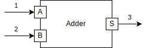

###########
First Steps
###########

**********
Installing
**********

PyFMU can be installed using pip or installing from source.
Installing using pip is the recommended approach:

.. code-block:: Bash

   pip install pyfmu

Alternatively, the package may be built from source. 
The first step of this is to obtain the source code from github:

.. code-block:: Bash

   git clone https://github.com/INTO-CPS-Association/pyfmu.git

The package may be installed in the system using pip by invoking:

.. code-block:: Bash

   pip install .

The recommended way to verify the installation and configuration of the tool is to run the `config`-subcommand with the following parameters.
Invoking the command should produce a result similar to the output shown below:

.. code-block:: bash

   pyfmu config --list
   backend.active=interpreter_msgqueue
   backend.embedded_cpython.libpython=.../python3.dll
   backend.interpreter_msgqueue.executable=../python.exe
   backend.interpreter_msgqueue.protocol=tcp
   log_stdout=False

.. note::

   During installation the tool will attempt to create a configuration by locating certain programs and inferring various pieces of information.
   For more information on the use of these variables and how to set them see :ref:`config`.

***************
Creating an FMU
***************

The process of creating an FMU using PyFMU can be split into 3 steps:

1. Generating a project.
2. Implementing its behavior.
3. Exporting the project as an FMU.

The process of creating a new FMU is illustrated for a simple two input adder.
The FMU takes as input two real values a and b, and produces a real-valued output s.

To generate a new project the *generate* subcommand is used:

.. code-block:: bash

   pyfmu generate somedir/adder

This will generate a new project containing two files and a directory:

- adder.py
- project_configuration.json
- pyfmu

For now we concentrate on the file *adder.py* which contains the definition for the class *Adder*.
The script is referred to as the *slave script* and class defined within it the *slave class*.
When the FMU is instantiated the slave class serves as an implementation of the FMU.

By default the generate command creates a template of the slave class which must be filled out. 
  
.. code-block:: Python

   class Adder(Fmi2Slave):

      def __init__(self, *args, **kwargs):

        author = ""
        modelName = "Adder"
        description = ""

        super().__init__(
            modelName=modelName,
            author=author,
            description=description,
            *args,
            **kwargs
            )

      ...

      def do_step(self, current_time: float, step_size: float) -> bool:
         pass

The Adder is a subclass of the Fmi2Slave provided by the *PyFMU library*. The class provides methods related to the FMI interface.

The first step is to declare the inputs and outputs of the model. 
This done programatically using the *register_variable* function provided by the base class. In the case of the adder we must define two inputs and a single output.

.. code-block:: Python

   class Adder(Fmi2Slave):

      def __init__(self, *args, **kwargs):

         author = ""
         modelName = "Adder"
         description = ""

         super().__init__(
               modelName=modelName,
               author=author,
               description=description,
               *args,
               **kwargs
               )
               
         self.register_variable("s", data_type=Fmi2DataTypes.real, causality=Fmi2Causality.output)
         self.register_variable("a", data_type=Fmi2DataTypes.real, causality=Fmi2Causality.input, start=0.0)
         self.register_variable("b", data_type=Fmi2DataTypes.real, causality=Fmi2Causality.input, start=0.0)
      
The declared variables are automatically added as attributes to the instance. They may be acessed like any other instance variable using the self pointer.
It is important to notice that the variables type is *real*, and it is therefore necessary to initialize the variables as python floats. In this case, the start value is zero, and must therefore be written as *0.0* in order to be interpreted as a float.

.. code-block:: Python

   print(self.s) # prints the current sum

Using this mecanism the FMU may be implemented by overriding the *do_step* and *enter_initialization_mode* functions of the baseclass.

.. code-block:: Python

   def enter_initialization_mode(self):
      self.s = self.a + self.b
      return True

   def do_step(self, current_time: float, step_size: float) -> bool:
      self.s = self.a + self.b
      return True

It is only necessary to define the FMI functions you use, since the baseclass defines defaults which do nothing.

Let's take a look at the variable *self.s*, which is the sum in the *Adder*. 
It is important when creating an FMU, that you initialize output variables, such as *self.s* either in the enter\_initialization\_mode() function, or in the constructor (the \__init\__ function).
