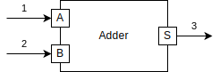

.. pyfmu documentation master file, created by
   sphinx-quickstart on Wed Feb 12 15:02:38 2020.
   You can adapt this file completely to your liking, but it should at least
   contain the root `toctree` directive.

PyFMU
=====

PyFMU is a tool for developing *functional mock-up units* (FMUs) using Python.
The goal is to provide rapid prototyping capabilities to a wide range of applications.

Installing
----------

PyFMU is available as a pre-built package through PyPI and Anaconda.

To install the package through PyPI use pip:

.. code-block:: Bash

   pip install pyfmu

To install the package through conda use:

.. code-block:: Bash

   conda install pyfmu

Alternatively, the package may be built from source. The first step of this is to obtain the source code from github:

.. code-block:: Bash

   git clone https://github.com/INTO-CPS-Association/pyfmu.git

The package may be installed in the system using pip by invoking:

.. code-block:: Bash

   pip install .

Getting started
---------------

The process of creating an FMU using PyFMU can be split into 3 steps:

#. Generating a project.
#. Implementing its behavior.
#. Exporting the project as an FMU.

The process of creating a new FMU is illustrated for a simple two imput adder.
The FMU takes as input two real values a and b, and produces a real-valued output s.

To generate a new project the *generate* subcommand is used:

.. code-block:: bash

   pyfmu generate somedir/adder

This will generate a new project containing two files and a directory:

- adder.py
- project_configuration.json
- pyfmu

For now we concentrate on the file *adder.py* which contains the definition for the class *Adder*.
The script is referred to as the *slave script* and class defined within it the *slave class*.
When the FMU is instantiated the slave class serves as an implementation of the FMU.

By default the generate command creates a template of the slave class which must be filled out. 
  
.. code-block:: Python

   class Adder(Fmi2Slave):

      def __init__(self):
         super().__init__()

      ...

      def do_step(self, current_time: float, step_size: float) -> bool:
         pass

The Adder is a subclass of the Fmi2Slave provided by the *PyFMU library*. The class provides methods related to the FMI interface.

The first step is to declare the inputs and outputs of the model. 
This done programatically using the *register_variable* function provided by the base class. In the case of the adder we must define two inputs and a single output.

.. code-block:: Python

   class Adder(Fmi2Slave):

      def __init__(self):
         super().__init__()
         self.register_variable("s", data_type=Fmi2DataTypes.real, causality=Fmi2Causality.output)
         self.register_variable("a", data_type=Fmi2DataTypes.real, causality=Fmi2Causality.input, start=0)
         self.register_variable("b", data_type=Fmi2DataTypes.real, causality=Fmi2Causality.input, start=0)
      
The declared variables are automatically added as attributes to the instance. They may be acessed like any other instance variable using the self pointer.

.. code-block:: Python

   print(self.s) # prints the current sum

Using this mecanism the FMU may be implemnted by overriding the *do_step* and *exit_initialization_mode* functions of the baseclass.

.. code-block:: Python

   def exit_initialization_mode(self):
      self.s = self.a + self.b
      return True

   def do_step(self, current_time: float, step_size: float) -> bool:
      self.s = self.a + self.b
      return True

It is only necessary to define the FMI functions you use, since the baseclass defines defaults which do nothing.

.. toctree::
   :maxdepth: 2
   :caption: Contents:

