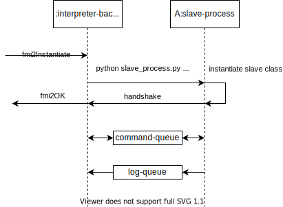

# PyFMU Interpreter Backend

## Logging

Explain that a message queue is used to print messages
and that a separate thead is used for logging

## Commands

| Name                         | id  | Arguments | Supported | Notes                                       |
| ---------------------------- | --- | --------- | --------- | ------------------------------------------- |
| fmi2FreeInstance             | 0   |           |           | Destroy slave instance then process         |
| fmi2SetDebugLogging          | 1   | c         | x         |                                             |
| fmi2SetupExperiment          | 2   | f         | x         |                                             |
| fmi2EnterInitializationMode  | 3   | f         | x         |                                             |
| fmi2ExitInitializationMode   | 4   | f         | x         |                                             |
| fmi2Terminate                | 5   | f         | x         |                                             |
| fmi2Reset                    | 6   | f         | x         |                                             |
| fmi2GetXXX                   | 7   | f         | x         | generalization of getters for various types |
| fmi2SetXXX                   | 8   | f         | x         | generalization of setters for various types |
| fmi2SetRealInputDerivatives  | 9   | f         |           | not implemented                             |
| fmi2GetRealOutputDerivatives | 10  | f         |           | not implemented                             |
| fmi2DoStep                   | 11  | f         | x         |
